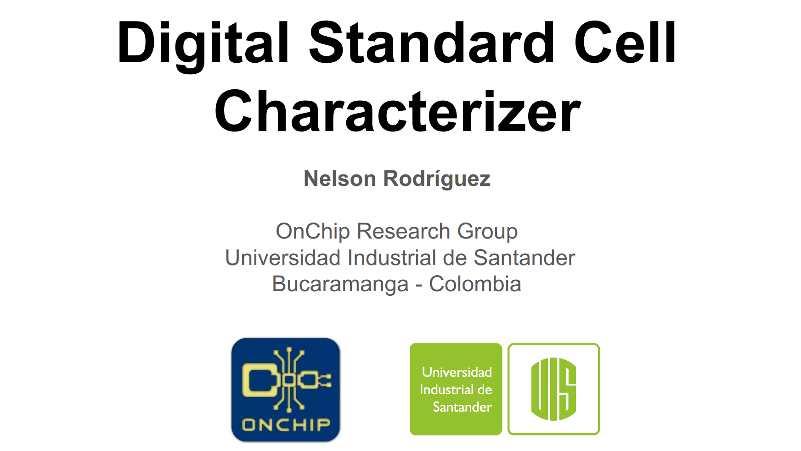

# Digital Standard Cell Characterizer (DSCC)  

## Demo

> 📌 **Important:**  
> The output load are in picofarads [pF] and the transition times in nanoseconds [ns].  
> The tool currently only supports combinational

~~~ bash
python3 dscc.py thesis_aoi211.mag \\
--sky130-root="/home/nelson/cad" \\
--output-loads="0.05, 0.1" \\
--slew-rates="0.1, 0.2"
~~~

<video src="https://github.com/ledzeg/dscc/assets/107968926/f1b6e461-1123-4a2b-9a38-43193d59e5ea"></video>

## Slides
#### In these slides you will find an explanation on how the tool was developed, that is, the algorithms to characterize the cells and to identify the logical function of them. This tool was developed to be used in the main proyect of [Open-Source Standard Cell Design Methodology](https://github.com/ledzeg/stdcell-methodology) 
 

<b >👇🏼 Click on the image to watch the slides</b>

 

